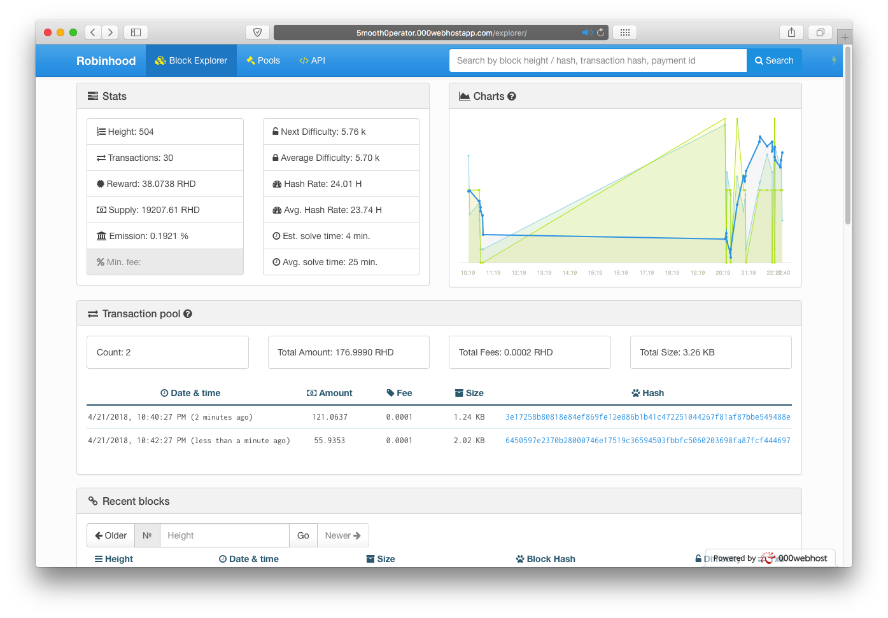
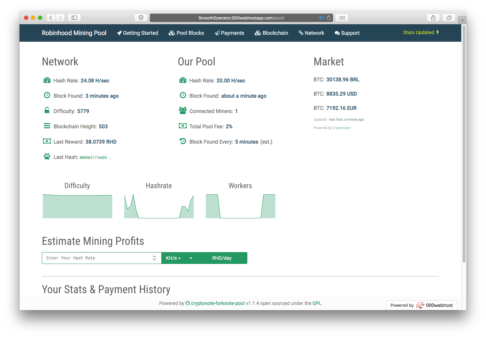
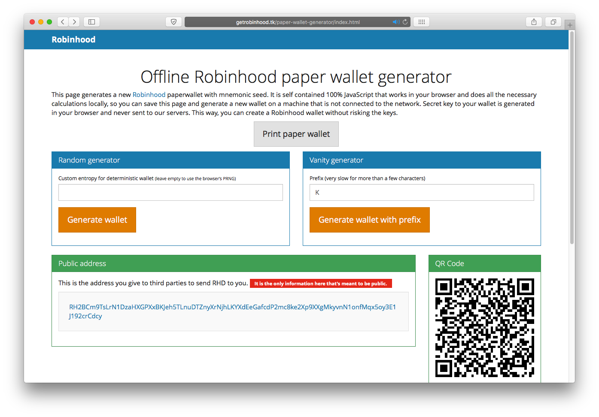

## Download Robinhood

#### Select your system

| Windows        | Apple          | Linux |
|:-------------|:------------------|:------|
| Robinhood Windows GUI Installer | Robinhood Apple GUI   | Robinhood Linux GUI  |
| Robinhood Windows GUI           | Robinhood Apple CLI   | Robinhood Linux CLI  |
| Robinhood Windows CLI           |

All releases are on: https://github.com/5mooth0perator/robinhoodwallet

### Fun Robinhood Facts

> Robinhood has a 2 minutes block time, which means transactions confirm faster.

> Robinhood has a private blockchain, nobody sees your money except you.

> You can restore a deleted Robinhood wallet with your view key and spend key.

### More Robinhood stuff!

#### 1. [Robinhood Blockchain Explorer](https://jekyllrb.com/) (source code)

#### 2. [Robinhood Mining Pool](https://jekyllrb.com/) (source code)

#### 3. [Robinhood Offline Paper Wallet](https://jekyllrb.com/) (source code)

