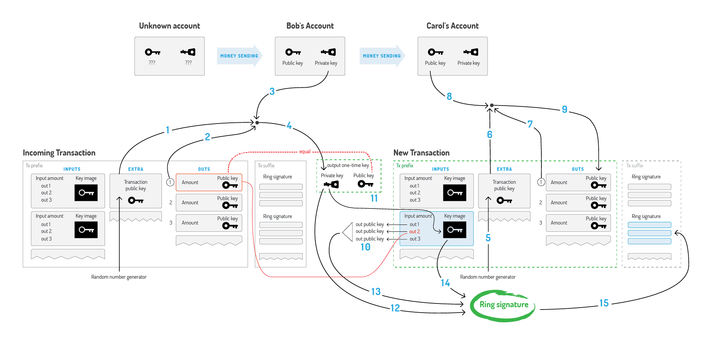

## Shaping the future of the global economy with Robinhood

The current power distribution on our planet is the legacy of the world where the economy is controlled by the few. The status quo was shaped throughout centuries, making human beings engage in rat races, detrimental rivalry, and bloodshed. In spite of humanity's hope to overcome local crises through education and internationalization, we still fail to have full control over our lives.  

However, state-of-the-art advancements in technology, mathematics, and cryptography may become the key to subvert this paradigm. The advent of cryptocurrencies is the first sign that the new world is coming. It is marked with a hope that the economy will interlace with the technology, that communities will set new transparent principles, and impartial cryptographic algorithms will control its implementation.  

It is in our philosophy to encourage enlightenment through breakthrough innovations. Emancipation begins with laymen getting access to financial resources that will give the oppressed the hope for quality education, drinking water, and a better life. Robinhood is not about creating yet another digital currency. It is the mindset and concepts that represent the first small step to regain the power over ourselves in order to live peacefully and prosper.

CryptoNote is the technology that allows the creation of completely anonymous egalitarian cryptocurrencies. A number of CryptoNote community members have been focused on research and development for more than a decade. We aim to promote the derived principles to influence the contemporary economic paradigm.  

### Robinhood specifications

| Name                      | Robinhood                               |
|:--------------------------|:------------------------------------|
| Ticker                    | RHD                     |
| Symbol                    | R                       |
| Proof-of-work algorithm   | CryptoNight             |
| Block time                | 240 seconds             |
| Difficulty                | Retarget each block     |
| Block reward              | Slight decrease every block according to formula: `BaseReward = (MSupply - A)/218` where `MSupply` is the number of atomic units and `A` is amount of already generated coins          |
| Divisible up to           | 1012 atomic units (up to 12 decimal places)            |
| Emission                  | Infinite, initial supply – 10,000,000,000,000,000,000 atomic units, or 10 million rhd.            |
| Tail emission             | ~1.2% of initial supply per year, minimal block reward: 1 rhd.            |

### Robinhood key features

#### Untraceable payments

> Robinhood uses ring signatures and one-time addresses for truly anonymous payments.

Robinhood provides users with a completely anonymous payment scheme. Robinhood implements the ring signature technology which allows you to sign a message on behalf of a group. The signature only proves the message was created by someone from the group, but all the possible signers are indistinguishable from each other.

#### Unlinkable transactions

> Robinhood's transactions can't be linked between the sender and the recipient.

Even if outgoing transactions are untraceable, everyone may still be able to see the payments you have received and thus determine your income. However, by using a variation of the Diffie-Hellman exchange protocol, a receiver has multiple unique one-time addresses derived from his single public key. After funds are sent to these addresses they can only be redeemed by the receiver; and it would be impossible to cross-link these payments.

#### Double-spending proof

Nobody is able to spend the same money twice — even if all his signatures are anonymous. Every signature contains a key image — a kind of fingerprint of the secret key. It is based on a one-way cryptographic function; this implies that given only the key image it is impossible to restore the corresponding secret key. These key images are used to prevent double-spending.

#### Blockchain analysis resistance

Non-repeating one-time addresses and mixed keys in ring signatures make the whole blockchain resistant to analysis. Each future transaction will only increase the entropy and create additional obstacles for an analyst.

#### Egalitarian proof of work

> Robinhood hash function is designed for egalitarian GPU & CPU mining.

The proof of work mechanism acts as a voting system. Thus, it is crucial that during the voting process all the participants have equal voting privileges. Robinhood brings this equality with its egalitarian proof of work, utilizing built-in CPU instructions, which are very hard and too expensive to implement in special purpose devices, but perfectly suitable for ordinary PCs.

####  Adaptive parameters

> Robinhood currency intelligently adjusts its parameters based on the historical data.

A decentralized payment system must not depend on a single person's decisions, even if this person is a developer. Robinhood has no hard-coded constants; magic numbers in the code are designed to be re-calculated based on the previous state of the network. Thus, they always change adaptively and independently, allowing the network to develop on its own.

### Powered by CryptoNote, an open-source technology and concepts for the cryptocurrencies of the future

In a mass surveillance world we develop and promote new approaches to further decentralize
and emancipate cryptocurrencies. We use advanced mathematical analysis and innovative ideas to empower end-users with true privacy, both financial and personal.

We share our ideas to shift the current global paradigm through cryptography and egalitarianism.

#### Ring signatures: Untraceable payments

The ordinary digital signature (e.g. (EC)DSA, Schnorr, etc...) verification process involves the public key of the signer. It is a necessary condition, because the signature actually proves that the author possesses the corresponding secret key. But it is not always a sufficient condition.


_Ordinary signature_

**Ring signature** [1] is a more sophisticated scheme, which in fact may demand several different public keys for verification. In the case of ring signature, we have a group of individuals, each with their own secret and public key. The statement proved by ring signatures is that the signer of a given message is a member of the group. The main distinction with the ordinary digital signature schemes is that the signer needs a single secret key, but a verifier cannot establish the exact identity of the signer. Therefore, if you encounter a ring signature with the public keys of Alice, Bob and Carol, you can only claim that one of these individuals was the signer but you will not be able to pinpoint him or her.


_Ring signature_

This concept can be used to make digital transactions sent to the network untraceable by using the public keys of other members in the ring signature one will apply to the transaction. This approach proves that the creator of the transaction is eligible to spend the amount specified in the transaction but his identity will be indistinguishable from the users whose public keys he used in his ring signatures.


_Untraceable transactions_

It should be noted that foreign transactions do not restrict you from spending your own money. Your public key may appear in dozens of others' ring signatures but only as a muddling factor (even if you already used the corresponding secret key for signing your own transaction). Moreover, if two users create ring signatures with the same set of public keys, the signatures will be different (unless they use the same private key).

_[1] Ronald L. Rivest, Adi Shamir, and Yael Tauman. How to leak a secret. In ASIACRYPT, pages 552–565, 2001_

#### One-time keys: Unlinkable transactions

Normally, when you post your public address, anyone can check all your incoming transactions even if they are hidden behind a ring signature. To avoid linking you can create hundreds of keys and send them to your payers privately, but that deprives you of the convenience of having a single public address.


_Linkable transactions_

CryptoNote solves this dilemma by an automatic creation of multiple unique one-time keys, derived from the single public key, for each p2p payment. The solution lies in a clever modification of the **Diffie-Hellman exchange protocol** [1]. Originally it allows two parties to produce a common secret key derived from their public keys. In our version the sender uses the receiver's public address and his own random data to compute a one-time key for the payment.

The sender can produce only the public part of the key, whereas only the receiver can compute the private part; hence the receiver is the only one who can release the funds after the transaction is committed. He only needs to perform a single-formula check on each transactions to establish if it belongs to him. This process involves his private key, therefore no third party can perform this check and discover the link between the one-time key generated by the sender and the receiver's unique public address.


_Unlinkable transactions_

An important part of our protocol is usage of random data by the sender. It always results in a different one-time key even if the sender and the receiver both remain the same for all transactions (that is why the key is called "one-time"). Moreover, even if they are both the same person, all the one-time keys will also be absolutely unique.

_[1] Whitfield Diffie and Martin Hellman. New directions in cryptography. IEEE Transactions on Information Theory 22 (6): 644–654, 1976._

#### Double-spending proof

Fully anonymous signatures would allow spending the same funds many times which, of course, is incompatible with any payment system's principles. The problem can be fixed as follows.
A ring signature is actually a class of crypto-algorithms with different features. The one CryptoNote uses is the modified version of the "**Traceable ring signature**" [1]. In fact we transformed traceability into linkability. This property restricts a signer's anonymity as follows: if he creates more than one ring signature using the same private key (the set of foreign public keys is irrelevant), these signatures will be linked together which indicates a double-spending attempt.

To support linkability CryptoNote introduced a special marker being created by a user while signing, which we called a **key image**. It is the value of a cryptographic one-way function of the secret key, so in math terms it is actually an image of this key. One-wayness means that given only the key image it is impossible to recover the private key. On the other hand, it is computationally impossible to find a collision (two different private keys, which have the same image). Using any formula, except for the specified one, will result in an unverifiable signature. All things considered, the key image is unavoidable, unambiguous and yet an anonymous marker of the private key.


_Key image via one-way function_

All users keep the list of the used key images (compared with the history of all valid transactions it requires an insignificant amount of storage) and immediately reject any new ring signature with a duplicate key image. It will not identify the misbehaving user, but it does prevent any double-spending attempts, caused by malicious intentions or software errors.


_Double-spending check_

_[1] Eiichiro Fujisaki and Koutarou Suzuki. Traceable ring signature. In Public Key Cryptography, pages 181–200, 2007._

#### CryptoNote blockchain analysis resistance

There are many academic papers dedicated to the analysis of the Bitcoin's blockchain. Their authors trace the money flow, identify the owners of coins, determine wallet balances and so on. The ability to make such analysis is due to the fact that all the transfers between addresses are transparent: every input in a transaction refers to a unique output. Moreover, users often re-use their old addresses, receiving and sending coins from them many times, which simplifies the analyst's work. It happens unintentionally: if you have a public address (for example, for donations), you are sure to use this address in many inputs and transactions.

CryptoNote is designed to mitigate the risks associated with key re-usage and one-input-to-one-output tracing. Every address for a payment is a unique one-time key, derived from both the sender's and the recipient's data. It can appear twice with a probability of a 256-bit hash collision. As soon as you use a ring signature in your input, it entails the uncertainty: which output has just been spent?

Trying to draw a graph with addresses in the vertices and transactions on the edges, one will get a tree: a graph without any cycles (because no key/address was used twice). Moreover, there are billions of possible graphs, since every ring signature produces ambiguity. Thus, you can't be certain from which possible sender the transaction-edge comes to the address-vertice. Depending on the size of the ring you will guess from "one out of two" to "one out of a thousand". Every next transaction increases the entropy and creates additional obstacles for an analyst.


_Blockchain analysis ambiguity_

#### Standard CryptoNote transaction

A standard CryptoNote transaction is generated by the following sequence covered in the white paper.

Bob decides to spend an output, which was sent to the one-time public key. He needs Extra (1), TxOutNumber (2), and his Account private key (3) to recover his one-time private key (4).

When sending a transaction to Carol, Bob generates its Extra value by random (5). He uses Extra (6), TxOutNumber (7) and Carol's Account public key (8) to get her Output public key (9).

In the input Bob hides the link to his output among the foreign keys (10). To prevent double-spending he also packs the Key image, derived from his One-time private key (11).
Finally, Bob signs the transaction, using his One-time private key (12), all the public keys (13) and Key Image (14). He appends the resulting Ring Signature to the end of the transaction (15).


_A standard CryptoNote transaction (click to enlarge)_

#### Adaptive limits

A decentralized payment system must not depend on a single person's decisions, even if this person is a core developer. Hard constants and magic numbers in the code deter the system's evolution and therefore should be eliminated (or at least be cut down to the minimum). Every crucial limit (like max block size or min fee amount) should be re-calculated based on the system's previous state. Therefore, it always changes adaptively and independently, allowing the network to develop on it's own.

CryptoNote has the following parameters which adjust automatically for each new block:

1. **Difficulty.** The general idea of our algorithm is to sum all the work that nodes have performed during the last 720 blocks and divide it by the time they have spent to accomplish it. The measure of the work is the corresponding difficulty value for each of the blocks. The time is calculated as follows: sort all the 720 timestamps and cut-off 20% of the outliers. The range of the rest 600 values is the time which was spent for 80% of the corresponding blocks.

2. **Max block size.** Let MN be the median value of the last N blocks sizes. Then the "hard-limit" for the size of accepting blocks is 2*MN. It averts blockchain bloating but still allows the limit to slowly grow with the time if necessary. Transaction size does not need to be limited explicitly. It is bounded by the size of the block.

#### Smooth emission

The upper bound for the overall amount of all digital coins is also digital:

```MSupply = 264 − 1 atomic units```

This is a natural restriction based only on the implementation limits, not on intuition like "N coins ought to be enough for everybody". To make the emission process smoother CryptoNote uses the following formula for block rewards:

```BaseReward = (MSupply − A) >> 18```

where A is amount of previously generated coins. It gives a predictable growth of the money supply without any breakpoints.

#### Egalitarian proof of work

The proof of work mechanism is actually a voting system. Users vote for the right order of the transactions, for enabling new features in the protocol and for the honest money supply distribution. Therefore, it is important that during the voting process all participant have equal voting rights. CryptoNote brings the equality with an egalitarian proof-of-work pricing function, which is perfectly suitable for ordinary PCs. It utilizes built-in CPU instructions, which are very hard and too expensive to implement in special purpose devices or fast memory-on-chip devices with low latency.

We propose a new memory-bound algorithm for the proof-of-work pricing function. It relies on random access to a slow memory and emphasizes latency dependence. As opposed to scrypt, every new block (64 bytes in length) depends on all the previous blocks. As a result a hypothetical "memory-saver" should increase his calculation speed exponentially.
Our algorithm requires about 2 Mb per instance for the following reasons:

1. It fits in the L3 cache (per core) of modern processors, which should become mainstream in a few years;

2. A megabyte of internal memory is an almost unacceptable size for a modern ASIC pipeline;

3. GPUs may run hundreds of concurrent instances, but they are limited in other ways: GDDR5 memory is slower than the CPU L3 cache and remarkable for its bandwidth, not random access speed.

4. Significant expansion of the scratchpad would require an increase in iterations, which in turn implies an overall time increase. "Heavy" calls in a trust-less p2p network may lead to serious vulnerabilities, because nodes are obliged to check every new block's proof-of-work. If a node spends a considerable amount of time on each hash evaluation, it can be easily DDoSed by a flood of fake objects with arbitrary work data (nonce values).

One of the proof-of-work algorithms that is in line with our propositions is [CryptoNight](https://en.bitcoin.it/wiki/CryptoNight), created by Bytecoin developers in a cooperation with our team. It is designed to make CPU and GPU mining roughly equally efficient and restrict ASIC mining.

#### White paper

[White paper](assets/whitepaper.pdf) covering all the aspects of CryptoNote technology

#### CryptoNote Standards

CryptoNote Standards are the specification of the CryptoNote protocol as a peer-to-peer anonymous payment system. It describes technical details of CryptoNote whitepaper implementation.

| CNS              | TITLE                               | PUBLISHED      |
|:-----------------|:------------------------------------|:---------------|
| CNS001           | [CryptoNote Signatures (obsolete)](assets/cns001.txt)    | December 2011  |
| CNS002           | [CryptoNote Signatures](assets/cns002.txt)               | May 2012       |
| CNS003           | [CryptoNote Blockchain](assets/cns003.txt)               | September 2012 |
| CNS004           | [CryptoNote Transactions](assets/cns004.txt)             | September 2012 |
| CNS005           | [CryptoNote Transaction Extra Field](assets/cns005.txt)  | October 2012   |
| CNS006           | [CryptoNote One-Time Keys](assets/cns006.txt)            | November 2012  |
| CNS007           | [CryptoNote Keys and Addresses](assets/cns007.txt)       | November 2012  |
| CNS008           | [CryptoNight Hash Function](assets/cns008.txt)           | March 2013     |
| CNS009           | [CryptoNote Technology](assets/cns009.txt)               | August 2013    |
| CNS010           | [CryptoNote Difficulty Adjustment](assets/cns010.txt)    | August 2014    |

### Still Interested?

We need help! Join Us! No, seriously! Whatever your skill is, or what ideas you have, we are ready to hear about it!

#### [Join us on Telegram](https://t.me/joinchat/DqnU2RIxEDlVlxLdLFrn7g)

#### [Join us on GitHub](https://github.com/robinhoodcash)
